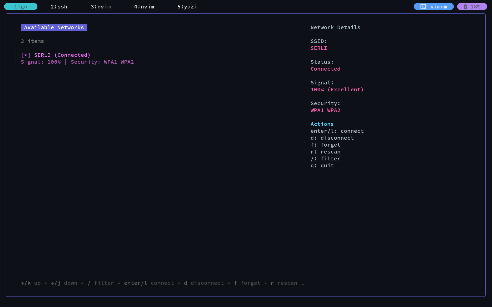

# 📶 vimnm

[](https://github.com/MatchaTi/vimnm/releases)
[](https://aur.archlinux.org/packages/vimnm-bin)

A lightweight, Vim-motion powered TUI for managing Wi-Fi connections on Linux using NetworkManager (`nmcli`).

## Preview



## ✨ Features

- **Vim-like Navigation**: Use `j`/`k` to navigate and `?` for help.
- **Fast Filtering**: Just press `/` to search for specific SSIDs.
- **Interactive Connection**: Connect to Wi-Fi with a clean password prompt.
- **Quick Disconnect**: Press `d` to disconnect from the active network.
- **Animated UI**: Built with the Bubble Tea framework for a smooth terminal experience.

## 🚀 Installation

### Arch Linux (AUR)

If you are on Arch Linux, you can install `vimnm-bin` from the AUR:

```bash
yay -S vimnm-bin
```

### From Source

Make sure you have Go installed:

```
git clone https://github.com/MatchaTi/vimnm.git
cd vimnm
go build -o vimnm
sudo mv vimnm /usr/local/bin/
```

## ⌨️ Keybindings

| Key            | Action                         |
| -------------- | ------------------------------ |
| `j`            | Move down                      |
| `k`            | Move up                        |
| `Enter` / `l`  | Connect to selected network    |
| `d`            | Disconnect from active network |
| `/`            | Filter or search networks      |
| `?`            | Show help menu                 |
| `ctrl+c` / `q` | Quit the application           |

## 🛠 Prerequisites

- `NetworkManager` must be installed and running on your system.
- `nmcli` installed by default with NetworkManager.

## 📝 Goals

- [ ] Rescan for networks.
- [ ] Forgotten networks management.
- [ ] Detail view for network information.

## 🧑‍💻 Contributing

Contributions are welcome! Please open an issue or submit a pull request on GitHub.
